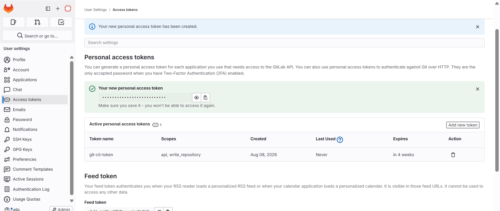
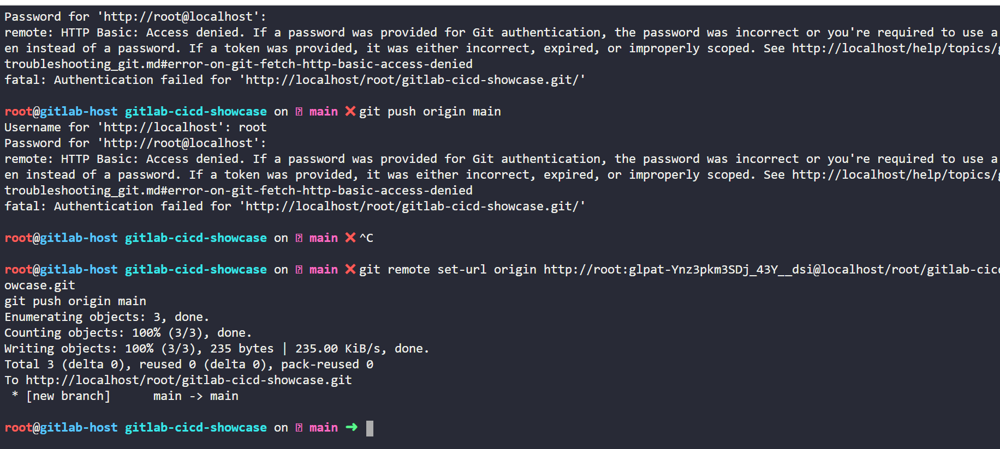
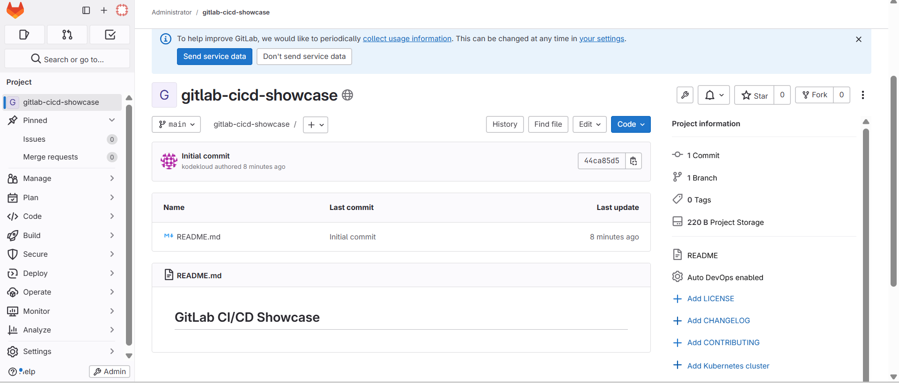
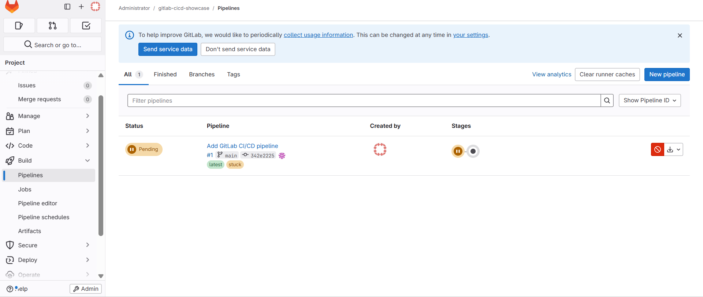
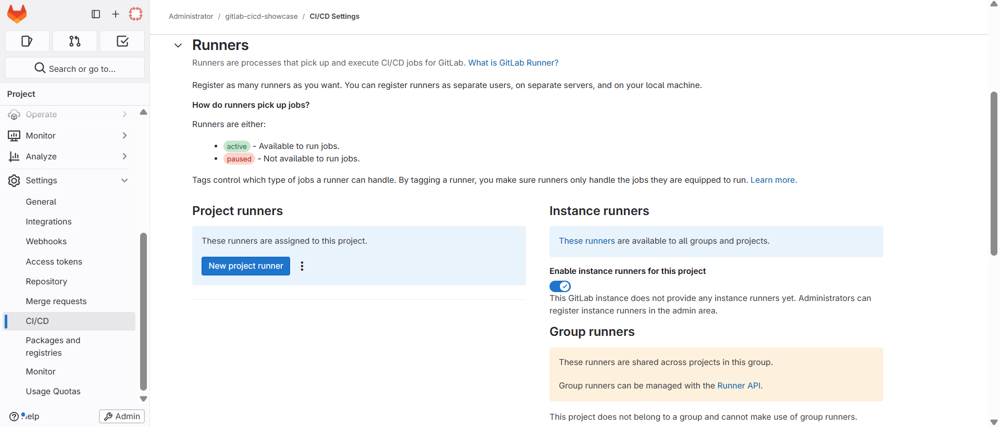
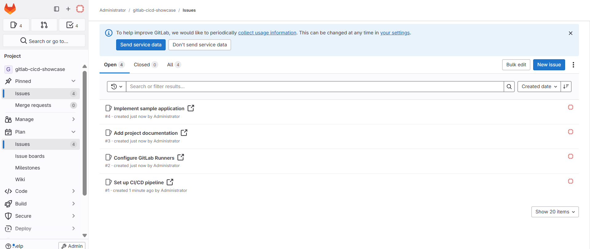
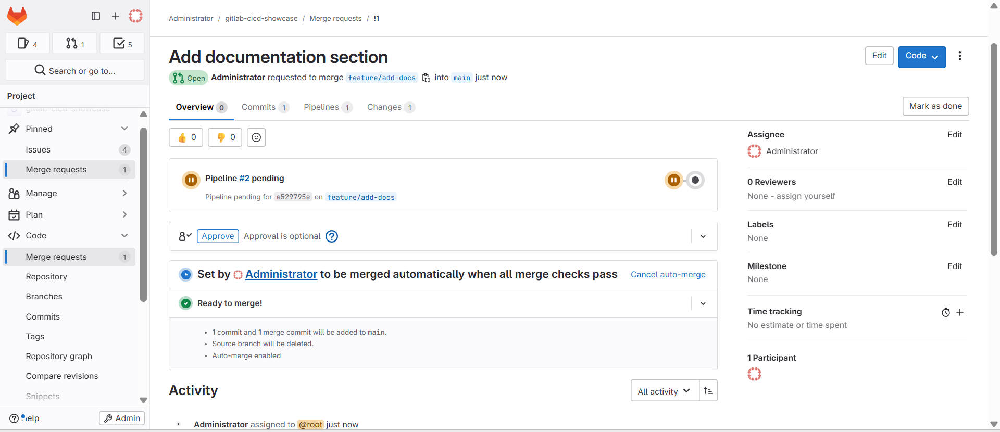
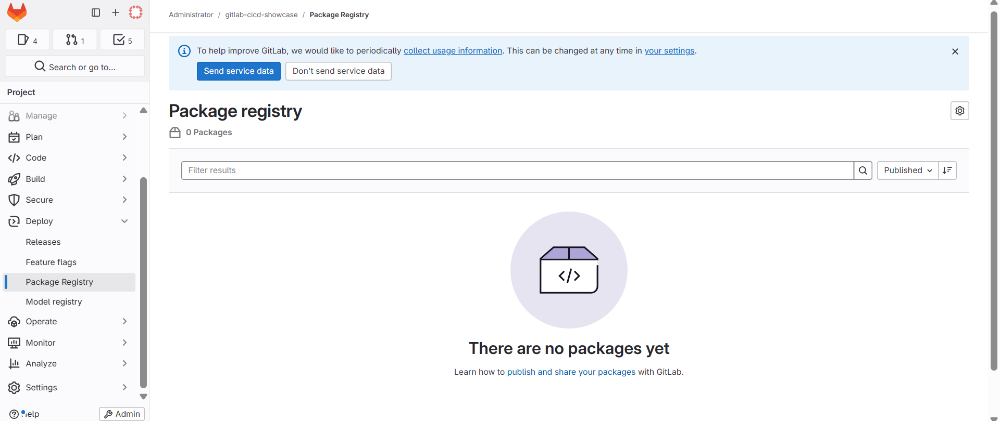

# 🦊 GitLab CI/CD Fundamentals — Hands-on Showcase

A hands-on showcase of GitLab's core DevOps toolchain — **Repository, CI/CD Pipelines, Issues, Merge Requests, and Package Registry** — built in a self-managed GitLab sandbox environment.


---

## 📌 Project Overview

This project demonstrates a complete GitLab DevOps workflow: creating a repository, configuring a CI/CD pipeline, tracking work with Issues, collaborating through Merge Requests, and exploring the Package Registry — all within a self-managed GitLab instance.

It complements a parallel project built on **Azure DevOps** ([azure-devops-taskmanager](https://github.com/sh-alo/azure-devops-taskmanager)), allowing a direct comparison between the two platforms' toolchains.

---

## 🧰 GitLab Tools Demonstrated

| GitLab Feature | Azure DevOps Equivalent | Status |
|---|---|---|
| Repository | Azure Repos | ✅ Created, first commit pushed |
| CI/CD Pipelines | Azure Pipelines | ✅ Configured (see note below) |
| Issues | Azure Boards (Work Items) | ✅ 4 issues created |
| Merge Requests | Pull Requests | ✅ Created and merged |
| Package Registry | Azure Artifacts | ✅ Verified available |

---

## 1️⃣ Repository

A blank project was created and connected to a local Git client using a **Personal Access Token** for HTTPS authentication (required since standard password auth is disabled for Git operations).

```bash
git clone http://localhost/root/gitlab-cicd-showcase.git
cd gitlab-cicd-showcase
git add README.md
git commit -m "Initial commit"
git push origin main
```

**Authentication note:** The first push attempt using the account password was rejected (`HTTP Basic: Access denied`) because GitLab requires a **Personal Access Token** for Git operations over HTTP instead of a plain password. A token with `api` and `write_repository` scopes was generated and used in the remote URL, after which the push succeeded.


*Personal Access Token generated with `api` and `write_repository` scopes.*


*Initial push rejected due to password auth, then succeeded after switching to token-based authentication.*


*Repository after the first successful push.*

---

## 2️⃣ CI/CD Pipelines

A `.gitlab-ci.yml` file was added to define a two-stage pipeline (build → test):

```yaml
stages:
  - build
  - test

build_job:
  stage: build
  image: node:20
  script:
    - echo "Building the project..."
    - echo "Build completed successfully!"

test_job:
  stage: test
  image: node:20
  script:
    - echo "Running tests..."
    - echo "All tests passed!"
```

**Note on execution:** The pipeline was successfully created and validated by GitLab, but remained in a *pending* state because this sandbox GitLab instance does not provide any Instance, Group, or Project Runners by default (`"This GitLab instance does not provide any instance runners yet"`). This is an environment limitation of the temporary training sandbox, not a configuration error — the YAML syntax and stage/job structure are valid and would execute normally on any GitLab instance with an active Runner.


*Pipeline #1 created successfully but stuck in "Pending" state.*


*CI/CD Settings confirming this GitLab instance provides no runners.*

---

## 3️⃣ Issues

Work was tracked using GitLab Issues, the equivalent of Azure Boards work items:

- Set up CI/CD pipeline
- Configure GitLab Runners
- Add project documentation
- Implement sample application


*Four issues tracking the planned work for this project.*

---

## 4️⃣ Merge Requests

A feature branch was created, changes were committed, and a Merge Request was opened and merged into `main`:

```bash
git checkout -b feature/add-docs
echo "## Documentation" >> README.md
git add README.md
git commit -m "Add documentation section"
git push origin feature/add-docs
```

Merge Request **#1** (`feature/add-docs` → `main`) was created and merged successfully, with auto-delete of the source branch enabled.


*Merge Request !1 approved and ready to merge, with auto-merge enabled.*

---

## 5️⃣ Package Registry

The Package Registry was verified as available and enabled for the project (equivalent to Azure Artifacts feeds), ready to host npm, Maven, or generic packages in future iterations.


*Package Registry confirmed available for the project, ready for future package publishing.*

---

## 🔄 Workflow Summary

1. Repository created and initialized with Git
2. `.gitlab-ci.yml` added to define automated build/test stages
3. Issues created to track planned work
4. A feature branch was merged via Merge Request following standard Git workflow
5. Package Registry confirmed available for future artifact publishing

---

## ⚠️ Environment Notes

This project was built inside a **temporary GitLab sandbox environment** (KodeKloud Playground) for learning purposes. As a result:
- No CI/CD Runners were available, so pipeline jobs could not execute (configuration only)
- The environment is not persistent — this README and its screenshots serve as the permanent record of the work performed

---

## 👤 Author

Built as a hands-on learning project to compare GitLab's DevOps toolchain with Azure DevOps.

- **GitHub:** [sh-alo](https://github.com/sh-alo)
- **Related project:** [azure-devops-taskmanager](https://github.com/sh-alo/azure-devops-taskmanager)

---

## 📄 License

This project is open-sourced for learning and portfolio purposes.
